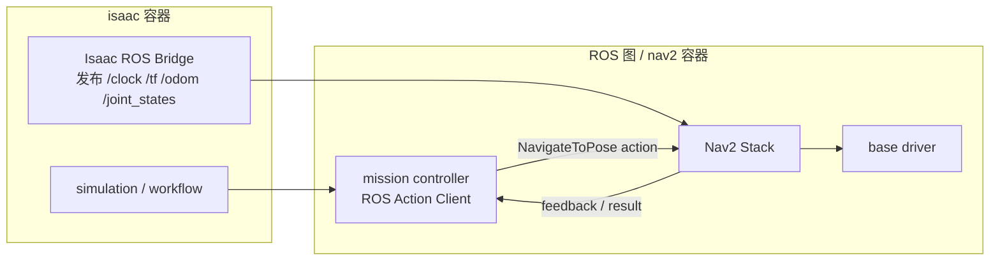
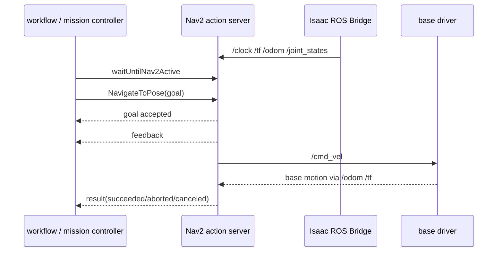

# Nav2 控制面对比说明

本文档用于说明当前项目中 `Isaac Sim + Nav2` 的控制面实现方式，与常见的标准 `ROS Bridge + Isaac Sim` 项目的实现方式之间的差异。

重点不在数据面。

这里说的“控制面”是指：

- 如何启动和复用 Nav2 栈
- 如何发起导航 goal
- 如何获取 goal 的执行状态
- 如何获取结果与取消任务

不包括：

- `/clock`
- `/odom`
- `/tf`
- `/joint_states`
- `/cmd_vel`

这些仍然属于 ROS topic 数据面。

---

## 1. 当前方案

当前项目中，控制面不是直接走 ROS action，而是走了一层共享存储目录协议。

整体结构如下：

```mermaid
flowchart LR
    subgraph Isaac["isaac 容器"]
        W["workflow / runtime manager"]
        B["Isaac ROS Bridge\n发布 /clock /tf /odom /joint_states"]
    end

    subgraph Shared["共享存储目录"]
        RQ["runtime_requests/*.yaml"]
        RS["runtime_status/*.yaml"]
        GQ["goal_requests/*.yaml"]
        GS["goal_status/*.yaml"]
        GR["goal_result/*.yaml"]
    end

    subgraph Nav2["nav2 容器"]
        SW["nav2_stack_watcher.py"]
        GE["nav2_goal_executor.py"]
        RD["ranger_driver_node.py"]
        NS["Nav2 Stack"]
        AC["NavigateToPose Action Client"]
    end

    W --> RQ
    W --> GQ
    W <-- RS
    W <-- GS
    W <-- GR

    RQ --> SW
    SW --> RS
    SW --> NS

    GQ --> GE
    GE --> GS
    GE --> GR
    GE --> AC
    AC --> NS

    NS --> RD
    B --> NS
```

### 1.1 这套方案的含义

当前控制链路不是：

- `workflow -> Nav2 action server`

而是：

- `workflow -> 文件请求`
- `文件请求 -> executor/watcher`
- `executor/watcher -> Nav2`

也就是说，项目在 ROS graph 之外，额外手写了一层控制协议：

- `runtime_request`
- `runtime_status`
- `goal_request`
- `goal_status`
- `goal_result`

---

## 2. 标准方案

在更常见的 `Isaac Sim + ROS2/Nav2` 项目里，控制面通常直接使用 ROS 原生机制：

- Nav2 lifecycle / launch 负责 bringup
- `NavigateToPose` action 负责任务控制
- mission controller 或 task node 直接作为 action client

结构通常如下：



这套结构下，控制面本身就是 ROS graph 的一部分，而不是文件轮询系统。

---

## 3. 标准控制时序

如果按标准 ROS action 控制面展开，时序通常如下：



控制语义全部由 ROS action 自己提供：

- 发 goal
- goal accepted
- feedback
- result
- cancel

这也是 Nav2 原生支持的工作方式。

---

## 4. 两种方案的核心差异

### 4.1 当前方案

当前方案实际上是：

- 数据面走 ROS
- 控制面走共享目录协议

也就是：

- topic 是 ROS 原生的
- goal 和状态管理是项目自己模拟出来的

### 4.2 标准方案

标准方案通常是：

- 数据面走 ROS topic
- 控制面走 ROS action / service / lifecycle

也就是：

- topic 是 ROS 原生的
- goal 和状态管理也是 ROS 原生的

---

## 5. 当前方案的问题点

从架构角度看，当前控制面有几个天然问题。

### 5.1 控制语义被拆成两层

当前链路是：

- `runtime manager -> 文件协议 -> goal_executor -> Nav2 action`

这意味着：

- `goal_status` 不是 Nav2 原生状态
- `goal_result` 不是 Nav2 原生结果对象
- 中间有一层项目自定义镜像协议

这层协议如果状态机设计不严谨，就会和 Nav2 自身状态机产生偏差。

### 5.2 request 是电平触发，不是边沿触发

共享文件目录的典型问题是：

- 请求文件只要还在，轮询方就可能再次消费
- 如果没有“已消费确认”或“幂等去重”，同一个 `goal_id` 可能被重复执行

### 5.3 status 是覆盖式快照，不是单调状态机

当前 `goal_status.yaml` 是单文件覆盖。

这种模式容易出现：

- 终态被后续中间态覆盖
- `goal_result` 和 `goal_status` 不一致
- 同一个 `goal_id` 的多个时刻信息被覆盖丢失

### 5.4 项目自己在模拟 action 语义

现在这套协议实际上是在自己重建一套简化版 action：

- request
- accepted
- running
- succeeded
- failed
- canceled

但 Nav2 本来就已经有：

- `NavigateToPose`
- feedback
- result
- cancel

所以当前方案相当于在 ROS action 外面又包了一层控制面。

---

## 6. 为什么标准项目一般不用共享目录控制面

标准 `Isaac Sim + Nav2` 项目之所以通常不这么做，原因主要有三点。

### 6.1 ROS action 已经完整覆盖导航控制需求

导航任务本来就是长时任务，ROS action 正好就是为这种语义设计的。

它天然支持：

- 异步执行
- 反馈
- 结果
- 取消
- goal 生命周期

### 6.2 lifecycle 已经覆盖 bringup 控制

Nav2 的启动和可用性判断通常不需要自定义状态文件。

更常见的是：

- launch bringup
- lifecycle manager 激活节点
- action client 等待 action server ready

### 6.3 ROS graph 本身就是控制平面

在标准项目里，ROS graph 既承载数据面，也承载控制面。

常见划分是：

- topic：状态、传感器、控制量
- action：长时任务控制
- service：配置和短操作

因此一般不会再额外引入共享目录去镜像控制状态。

---

## 7. 推荐理解方式

可以把两种方案简化理解成：

### 当前方案

- `workflow -> 文件消息总线 -> Nav2`

### 标准方案

- `workflow / mission node -> ROS action -> Nav2`

换句话说，当前项目的共享目录协议更像是：

- 在 ROS graph 外又实现了一层半套控制总线

而标准方案是：

- 直接把 ROS action 当成控制面本身

---

## 8. 对当前项目的启发

如果后续要继续收敛当前架构，最自然的方向通常不是改数据面，而是把控制面逐步向 ROS 原生方式靠拢。

也就是：

- 保留 Isaac ROS Bridge 发布 `/clock /odom /tf /joint_states`
- 保留 Nav2 作为外部容器
- 逐步去掉共享目录控制协议
- 让上层控制逻辑直接通过 `NavigateToPose` action 与 Nav2 交互

这样可以减少：

- 重复消费
- 状态镜像偏差
- `goal_status` / `goal_result` 不一致
- 自定义协议维护成本

---

## 9. 一句话总结

正常的 `ROS Bridge + Isaac Sim + Nav2` 项目里，控制面一般不是共享目录轮询，而是：

- 用 ROS action 做任务控制
- 用 lifecycle / launch 做 bringup 控制
- 用 ROS topic 做数据面

当前项目的共享存储区方案，本质上是在 ROS 控制面之外又叠加了一层自定义协议，这也是当前出现状态竞态和语义偏差的主要来源之一。
