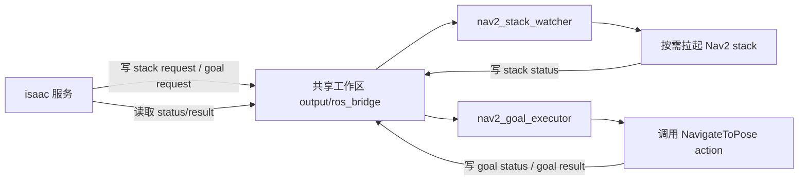
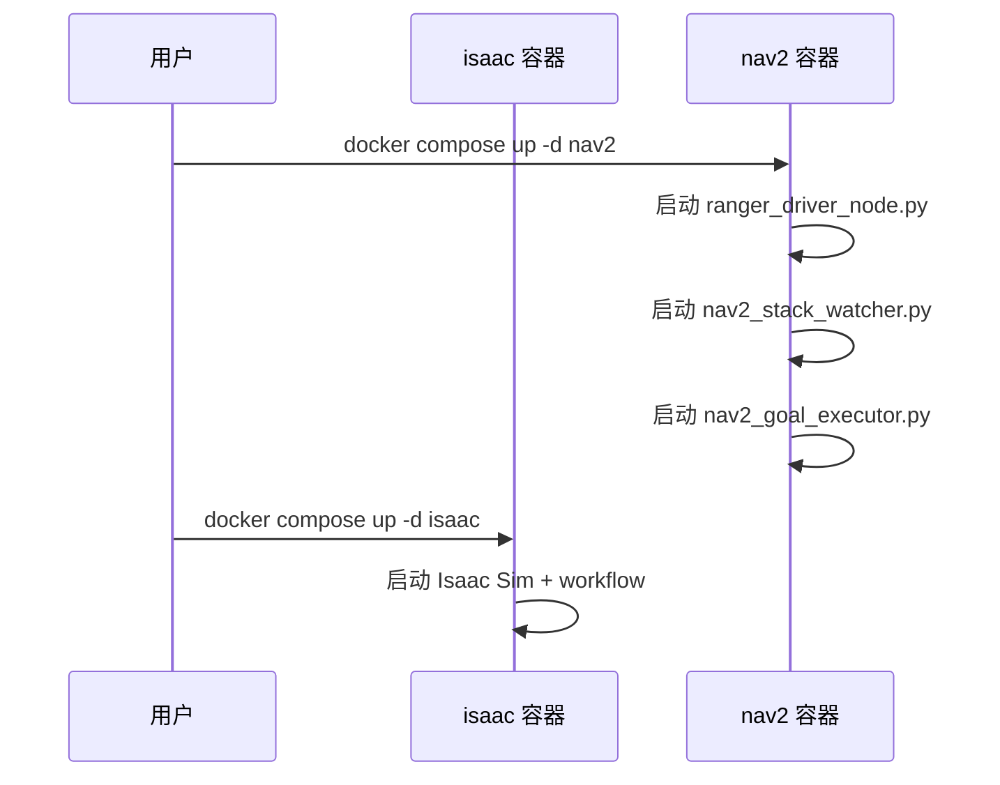
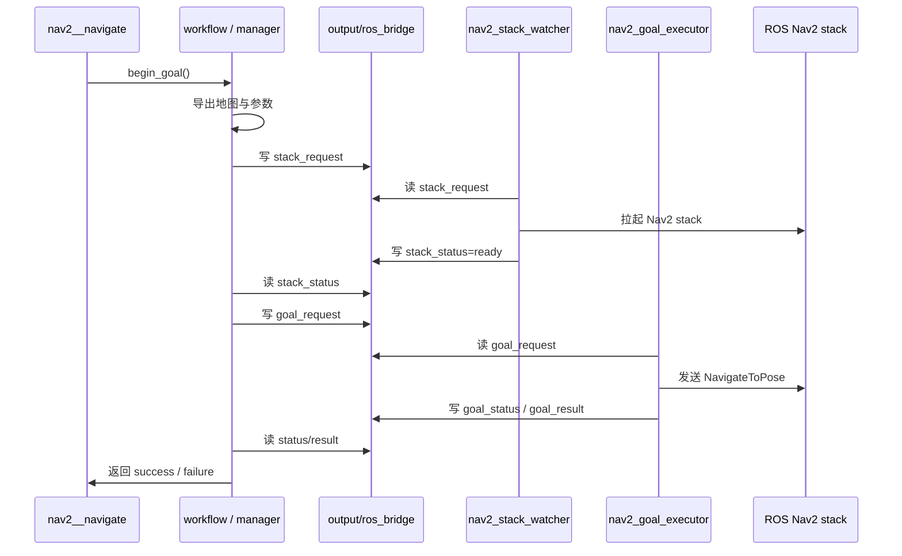

# Nav2 Split Compose 双服务架构说明

本文档描述当前仓库中已经落地的导航拆分部署架构。

目标不是再引入一个单独的 navigation skill 容器，而是在 `docker compose` 中只保留两个服务：

- `isaac`
- `nav2`

其中：

- `isaac` 负责仿真、workflow、地图导出、导航目标生成、`/clock` 发布
- `nav2` 负责 ROS 侧底盘驱动、Nav2 stack 拉起、导航 goal 执行

## 2026-04-18 调试结论

沿 `launcher.py + configs/simbox/de_plan_with_render_template.yaml` 真实链路做过一轮干净调试后，已经确认：

- `/clock`、`/odom`、`/tf`、`/joint_states` 并不是“发不出去”
- 这些 topic 在 `ros-base-bridge` 真正初始化之后，才会在 `nav2` 容器侧出现 publisher
- 在这之前，如果只看到 `omni.isaac.ros2_bridge` 扩展加载完成，并不代表 topic publisher 已经创建
- 之前出现“能发现 topic 但 `echo` 不到 sample”的现象，主要是两个原因叠加：
  - 旧的 `isaac-run` 容器残留，导致 `nav2` 侧 discovery 被历史 publisher 污染
  - 观察窗口选错，在 bridge 尚未初始化完成之前，或任务已经结束之后去采样

本轮干净实验的做法是：

1. 先停掉所有残留的 `isaac-nav2-stack-isaac-run-*` 容器
2. 在 `nav2` 容器里先启动长时间 `rclpy` 订阅器
3. 再启动新的 `launcher.py`
4. 等待 `ros-base-bridge` 初始化完成后重新采样

实际观测结果：

- 在 bridge 初始化前，`nav2` 侧 publisher 计数为 `0`
- 在出现以下日志后：
  - `[ros-base-bridge] Initialized 1 bridge(s): ['split_aloha']`
  - `[ros-nav2-runtime] Initialized 1 session manager(s): ['split_aloha']`
  `nav2` 侧可见 publisher 计数变为 `1`
- 在 publisher 出现后的 10 秒采样窗口内，`nav2` 侧实际收到：
  - `/clock`: 270 条
  - `/odom`: 134 条
  - `/tf`: 134 条
  - `/joint_states`: 135 条

因此，当前阻塞点已经不再是“ROS topic 发不出去”，而应继续聚焦：

- goal 发送时序与 action server ready 的竞态
- skill manager 何时发起第一个 goal
- goal executor 是否需要对首次 rejected 做重试或更严格的 ready 判定

## 设计目标

当前设计解决的是旧架构中 skill 直接依赖本进程内 Nav2 runtime 的问题。

改造后的目标是：

1. 让 workflow 侧 navigation skill 不再依赖 Isaac 进程内嵌的 Nav2 runtime 对象
2. 让 Nav2 可以作为独立 compose 服务运行，但仍保持和仿真侧的紧耦合协作
3. 不新增第三个导航服务，所有 ROS 侧导航相关常驻进程全部并入 `nav2`
4. 用文件协议替代直接的跨进程 Python 对象依赖，使两服务可独立启动、独立重连

## 总体拓扑



## 服务边界

### `isaac`

`isaac` 服务承担以下职责：

- 运行 `SimBoxDualWorkflow`
- 初始化每个机器人对应的 navigation session manager
- 在 skill 首次触发时导出静态地图与 Nav2 参数
- 将导航请求写入共享目录
- 在仿真主循环中发布 `/clock`
- 轮询 Nav2 执行状态，驱动 skill 完成或失败

关键实现位置：

- `docker/docker-compose.yml`
- `workflows/simbox_dual_workflow.py`
- `workflows/simbox/core/skills/nav2_navigate.py`
- `workflows/simbox/core/mobile/nav2/runtime.py`

### `nav2`

`nav2` 服务承担以下职责：

- 启动底盘命令桥接节点 `ranger_driver_node.py`
- 启动 `nav2_stack_watcher.py`
- 启动 `nav2_goal_executor.py`
- 按 request 文件动态拉起或刷新 ROS 侧 Nav2 stack
- 执行 `NavigateToPose` action，并将结果写回共享目录

关键实现位置：

- `docker/docker-compose.yml`
- `nav2/Dockerfile`
- `nav2/entrypoint.sh`
- `nav2/nav2_stack_watcher.py`
- `nav2/nav2_goal_executor.py`
- `nav2/ranger_driver_node.py`

## Compose 结构

当前主 compose 文件只定义两个服务：

- `isaac`
- `nav2`

`nav2` 服务直接使用 `nav2/Dockerfile`，并通过 `nav2/entrypoint.sh` 统一拉起 ROS 侧后台进程。

这意味着：

- watcher 不再是单独容器
- goal executor 不再是单独容器
- Nav2 stack 不是 compose 服务，而是由 watcher 在 `nav2` 容器内部按需启动的子进程

## Workflow 侧架构

### 1. skill 不再直接持有旧 runtime manager

`nav2__navigate` 不再依赖类似 `robot._simbox_nav2_runtime_manager` 这样的本地进程内对象。

当前 skill 的行为是：

1. 从 workflow 获取当前机器人对应的 navigation session manager
2. 调用 `begin_goal()`
3. 在每个仿真步中根据 manager 状态判断 skill 是否完成

对应实现：

- `workflows/simbox/core/skills/nav2_navigate.py`

### 2. workflow 统一管理 session manager

workflow 维护：

- `_navigation_session_managers`
- `_nav2_clock_publisher`

workflow 在 reset 和 step 阶段负责：

- 初始化 manager
- 为每台启用 Nav2 的机器人绑定上下文
- 在主循环中调用 manager `step()`
- 在仿真循环中统一发布 `/clock`
- reset / shutdown 时写 cancel 请求并做清理

对应实现：

- `workflows/simbox_dual_workflow.py`

### 3. manager 负责把仿真语义转换成文件协议

`PersistentNav2RuntimeManager` 是 workflow 侧的跨服务协调器。

它负责：

- 导出地图
- 生成 Nav2 参数文件
- 生成稳定的 `stack_id`
- 写 `stack_request`
- 写 `goal_request`
- 读取 `stack_status`
- 读取 `goal_status`
- 读取 `goal_result`
- 将 Nav2 状态映射成 skill 成功、失败、超时、取消等语义

对应实现：

- `workflows/simbox/core/mobile/nav2/runtime.py`

## ROS 侧架构

### 1. `entrypoint.sh`

`nav2` 容器启动后，`nav2/entrypoint.sh` 会：

1. source `/opt/ros/humble/setup.bash`
2. 启动 `ranger_driver_node.py`
3. 启动 `nav2_stack_watcher.py`
4. 启动 `nav2_goal_executor.py`

因此，`nav2` 服务本身就是 ROS 导航侧的主控容器。

### 2. `nav2_stack_watcher.py`

watcher 负责消费 stack request，并按机器人维度维护运行中的 Nav2 stack 子进程。

它的职责包括：

- 轮询 `runtime_requests/*.yaml`
- 检查参数文件和地图文件是否已准备好
- 按 request revision 判断是否需要重启 stack
- 在容器内部执行：
  - `static_transform_publisher`
  - `nav2_map_server`
  - `nav2_lifecycle_manager`
  - `ros2 launch nav2_bringup navigation_launch.py`
- 将状态写入 `runtime_status/*.yaml`
- 当 request 被关闭或 watcher 退出时，停止对应 Nav2 stack

注意：

- Nav2 stack 是 watcher 管理的子进程，不是 compose 服务
- 这样可以在不增加第三个服务的前提下，支持多次 skill 调用和 stack 复用

### 3. `nav2_goal_executor.py`

goal executor 负责消费 goal request，并把请求转成真正的 Nav2 action 调用。

它的职责包括：

- 轮询 `goal_requests/*.yaml`
- 等待对应 stack 进入 `ready`
- 创建 `NavigateToPose` action client
- 发送 goal
- 跟踪接受、运行、取消、成功、失败状态
- 订阅 `odom`，把最终位姿写入 result
- 将状态写入 `goal_status/*.yaml`
- 将结果写入 `goal_result/*.yaml`

## 文件协议

文件协议定义在：

- `workflows/simbox/core/mobile/nav2/protocol.py`

默认目录如下：

```text
output/ros_bridge/runtime_requests
output/ros_bridge/runtime_status
output/ros_bridge/goal_requests
output/ros_bridge/goal_status
output/ros_bridge/goal_result
```

### `stack_request`

由 `isaac` 写入，描述“应该为某个机器人启动哪个 Nav2 stack”。

主要字段包括：

- `enabled`
- `robot_name`
- `scene_name`
- `stack_id`
- `request_revision`
- `params_path`
- `map_yaml_path`
- `stack_output_dir`
- `status_path`
- `ros_domain_id`
- `rmw_implementation`
- `cmd_vel_topic`
- `odom_topic`
- `action_name`

### `stack_status`

由 `nav2_stack_watcher.py` 写入，描述 stack 当前状态。

典型状态包括：

- `waiting_for_artifacts`
- `starting`
- `ready`
- `failed`
- `stopped`

### `goal_request`

由 `isaac` 写入，描述“把某个导航目标发给当前 stack”。

主要字段包括：

- `enabled`
- `robot_name`
- `scene_name`
- `stack_id`
- `goal_id`
- `request_revision`
- `goal`
  - `x`
  - `y`
  - `yaw`
- `position_tolerance_m`
- `yaw_tolerance_rad`
- `runtime_timeout_sec`
- `startup_timeout_sec`
- `session_output_dir`
- `status_path`
- `result_path`
- `action_name`
- `odom_topic`
- `frame_id`
- `cancel_requested`

### `goal_status`

由 `nav2_goal_executor.py` 写入，描述当前 goal 的执行阶段。

典型状态包括：

- `waiting_for_stack`
- `waiting_for_action_server`
- `accepting`
- `accepted`
- `running`
- `succeeded`
- `aborted`
- `canceled`
- `failed`
- `rejected`

### `goal_result`

由 `nav2_goal_executor.py` 写入，描述最终结果。

主要字段包括：

- `robot_name`
- `stack_id`
- `goal_id`
- `state`
- `status_code`
- `detail`
- `reported_pose`

## 启动与执行时序

### 容器启动阶段



### skill 触发阶段



## 配置约定

当前默认导航配置在：

- `workflows/simbox/core/configs/nav/default_nav.yaml`

其中与 split compose 直接相关的关键项为：

- `ros.nav2.runtime_mode: external_compose`
- `ros.nav2.stack_request_root`
- `ros.nav2.stack_status_root`
- `ros.nav2.goal_request_root`
- `ros.nav2.goal_status_root`
- `ros.nav2.goal_result_root`
- `ros.nav2.stack_reuse`
- `ros.nav2.goal_transport: shared_file`

`configure_robot_for_nav2_skill()` 会把这些字段补齐到机器人 base config 中，确保 skill 在运行时总能找到协议目录。

## 当前运行状态

截至当前版本，以下内容已验证：

- `docker compose` 主文件只包含 `isaac` 与 `nav2` 两个服务
- `nav2` 镜像可构建
- `nav2` 容器可启动
- `nav2` 容器中确实运行了：
  - `ranger_driver_node.py`
  - `nav2_stack_watcher.py`
  - `nav2_goal_executor.py`
- `isaac` 容器可启动
- workflow 侧协议辅助模块单测通过

尚未在本文档范围内保证的部分：

- 某个具体任务场景下的完整端到端导航成功率
- 所有 integration runner 都已完全切到新架构
- 所有遗留调用点都已移除旧 Nav2 内嵌依赖

## 真实链路调试进展

当前已用下面这条真实入口反复验证：

- `launcher.py`
- `configs/simbox/de_plan_with_render_template.yaml`

已经打通的部分：

- Isaac 侧不再依赖系统级 ROS 2，改为 Isaac Sim 自带 `omni.isaac.ros2_bridge` + internal `rclpy`
- `EnvLoader` 会在创建 `SimulationApp` 后预热 Isaac ROS bridge
- workflow 已支持 `nav2__navigate` 作为“纯导航 skill”，不再强依赖双臂 CuRobo controller
- `PersistentNav2RuntimeManager` 已能真实导出：
  - 地图 `output/nav2_maps/nav2_asset_obstacles/*`
  - Nav2 参数 `output/ros_bridge/skills/split_aloha_nav2_asset_obstacles/stack/split_aloha_nav2_skill_params.yaml`
  - stack/status/goal/result 协议文件
- `nav2_stack_watcher.py` 已能按 request 拉起外部 Nav2 stack
- `nav2_goal_executor.py` 已能读取 goal request 并写回 `goal_status` / `goal_result`

本轮调试中已经修掉的真实链路问题：

- `runtime.py` 顶层 `rclpy` 依赖导致 workflow import 失败
- 导航-only task 仍初始化双臂 controller，导致缺少 `piper100_left_arm.yml`
- passive controller 缺少日志兼容字段，导致 `plan_with_render` 早期崩溃
- Nav2 参数 YAML 顶层误写 `odom_frame_hint`，导致 `navigation_launch.py` 的 `--params-file` 解析失败

当前剩余的主阻塞：

- 外部 Nav2 stack 已能启动，但 `controller_server` 激活阶段报：
  - `Timed out waiting for transform from base_link to map`
  - `Invalid frame ID "base_link" passed to canTransform`
- 这说明控制面已经通了，但数据面上 `Isaac -> nav2` 的 `/odom` 与 `/tf` 还没有稳定送达 Nav2 生命周期节点
- 在 `nav2` 容器内可以发现 `/odom`、`/tf` topic，但在短时间窗口内收不到实际消息，因此 controller_server 最终崩溃，goal 被 action server 拒绝

因此，当前状态应理解为：

1. `launcher -> workflow -> request/status 文件协议 -> 外部 Nav2 stack 拉起` 已经接通
2. 剩余问题集中在 `Isaac ROS bridge / internal rclpy publisher -> Nav2 DDS 数据接收` 这一段
3. 下一步应继续收敛 `odom/tf` 发布时机、发布稳定性或 stack 启动前的 TF 就绪判定

## 与旧架构的核心差异

旧架构更接近“skill 直接驱动本进程内 navigation runtime”。

当前架构的核心变化是：

1. skill 只面向 workflow manager，不直接面向 ROS runtime 对象
2. workflow manager 只通过共享文件与 ROS 服务通信
3. Nav2 stack 在 `nav2` 容器内部按需启动，而不是作为第三个 compose 服务存在
4. 统一由 workflow 发布 `/clock`，保证仿真时间和 Nav2 行为一致

## 相关文件索引

- Compose
  - `docker/docker-compose.yml`
- Isaac 侧 workflow
  - `workflows/simbox_dual_workflow.py`
- Skill
  - `workflows/simbox/core/skills/nav2_navigate.py`
- Workflow 侧 runtime manager
  - `nav2/runtime.py`
- 文件协议
  - `nav2/protocol.py`
- ROS 容器入口
  - `nav2/entrypoint.sh`
- ROS 侧 watcher
  - `nav2/nav2_stack_watcher.py`
- ROS 侧 goal executor
  - `nav2/nav2_goal_executor.py`
- 默认导航配置
  - `workflows/simbox/core/configs/nav/default_nav.yaml`
