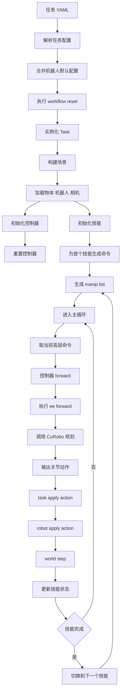

# SimBox 执行链路说明

本文档说明当前仓库从任务 `yml` 配置到最终仿真执行的完整链路。

## 总览

当前执行链路可以分成 6 层：

1. 任务配置解析
2. 任务与场景构建
3. 机器人、控制器、技能实例化
4. 技能生成高层操作序列
5. 控制器生成关节动作
6. 任务下发动作并推进仿真

## 执行图



## 第一层：任务配置解析

任务配置入口在：

- [`workflows/simbox/utils/task_config_parser.py`](/mnt/exdisk1/project/InternDataEngine/workflows/simbox/utils/task_config_parser.py#L25)

`TaskConfigParser.parse_tasks()` 会：

- 读取任务 `yml`
- 取出 `tasks:` 下的每个任务
- 转成普通字典结构

workflow 随后会把机器人默认配置合并进任务配置：

- [`workflows/simbox_dual_workflow.py`](/mnt/exdisk1/project/InternDataEngine/workflows/simbox_dual_workflow.py#L50)
- [`workflows/simbox_dual_workflow.py`](/mnt/exdisk1/project/InternDataEngine/workflows/simbox_dual_workflow.py#L57)

这里的合并规则是：

- `robot_config_file` 先作为基础配置
- 任务 `yml` 里的 `robots:` 字段再覆盖基础配置

例如：

- [`workflows/simbox/core/configs/tasks/example/sort_the_rubbish.yaml`](/mnt/exdisk1/project/InternDataEngine/workflows/simbox/core/configs/tasks/example/sort_the_rubbish.yaml#L1)

## 第二层：任务与场景构建

workflow 在 `reset()` 中创建任务：

- [`workflows/simbox_dual_workflow.py`](/mnt/exdisk1/project/InternDataEngine/workflows/simbox_dual_workflow.py#L73)
- [`workflows/simbox_dual_workflow.py`](/mnt/exdisk1/project/InternDataEngine/workflows/simbox_dual_workflow.py#L116)

这里会做几件事：

- 读取 `arena_file`
- 处理部分对象随机化
- 通过 `task_cfg["task"]` 找到任务类
- 将任务加入 `world`

以当前默认任务类为例：

- [`workflows/simbox/core/tasks/banana.py`](/mnt/exdisk1/project/InternDataEngine/workflows/simbox/core/tasks/banana.py#L36)

`BananaBaseTask.set_up_scene()` 会：

- 加载 arena fixtures
- 加载 objects
- 加载 robots
- 加载 cameras
- 根据 `regions` 随机摆放物体
- 创建 `pickcontact_views`
- 创建 `artcontact_views`

相关逻辑在：

- [`workflows/simbox/core/tasks/banana.py`](/mnt/exdisk1/project/InternDataEngine/workflows/simbox/core/tasks/banana.py#L65)
- [`workflows/simbox/core/tasks/banana.py`](/mnt/exdisk1/project/InternDataEngine/workflows/simbox/core/tasks/banana.py#L397)
- [`workflows/simbox/core/tasks/banana.py`](/mnt/exdisk1/project/InternDataEngine/workflows/simbox/core/tasks/banana.py#L348)

## 第三层：机器人、控制器、技能实例化

### 机器人

机器人由 task 负责加载：

- [`workflows/simbox/core/tasks/banana.py`](/mnt/exdisk1/project/InternDataEngine/workflows/simbox/core/tasks/banana.py#L247)

这里会根据 `target_class` 找到机器人类，并把 `robots:` 配置传进去。

### 控制器

控制器由 workflow 初始化：

- [`workflows/simbox_dual_workflow.py`](/mnt/exdisk1/project/InternDataEngine/workflows/simbox_dual_workflow.py#L221)

逻辑是：

- 遍历每个 robot 的 `robot_file`
- 根据文件名里是否包含 `left` / `right` 决定左右 controller
- 通过注册表找到具体 controller 类
- 调用 `reset()`

控制器注册表入口：

- [`workflows/simbox/core/controllers/__init__.py`](/mnt/exdisk1/project/InternDataEngine/workflows/simbox/core/controllers/__init__.py#L21)

### 技能

技能由 workflow 初始化：

- [`workflows/simbox_dual_workflow.py`](/mnt/exdisk1/project/InternDataEngine/workflows/simbox_dual_workflow.py#L185)

这里会把 `skills:` 配置组织成如下层次：

- 按任务阶段分组
- 每个阶段按 robot 分组
- 每个 robot 下按 left / right 分组
- 每只手内部是一个 skill 列表

技能注册表入口：

- [`workflows/simbox/core/skills/__init__.py`](/mnt/exdisk1/project/InternDataEngine/workflows/simbox/core/skills/__init__.py#L65)

## 第四层：技能生成高层操作序列

正式执行前，workflow 会先对当前第一组 skill 调用：

- [`workflows/simbox_dual_workflow.py`](/mnt/exdisk1/project/InternDataEngine/workflows/simbox_dual_workflow.py#L433)

也就是：

- `skill.simple_generate_manip_cmds()`

这一步不是直接生成关节轨迹，而是生成 `manip_list`。  
`manip_list` 里的每个元素通常是一个四元组：

1. 目标末端位置
2. 目标末端姿态
3. 控制动作名
4. 附加参数

例如 `pick` 的入口在：

- [`workflows/simbox/core/skills/pick.py`](/mnt/exdisk1/project/InternDataEngine/workflows/simbox/core/skills/pick.py#L68)

`Pick.simple_generate_manip_cmds()` 会：

- 读取抓取标注
- 采样抓取候选位姿
- 调用 controller 做可行性测试
- 选出一个可执行抓取
- 生成 pre-grasp / grasp / close_gripper / post-grasp 等命令

示例调用位置：

- [`workflows/simbox/core/skills/pick.py`](/mnt/exdisk1/project/InternDataEngine/workflows/simbox/core/skills/pick.py#L101)

这里 skill 的职责是：

- 决定做什么
- 决定顺序
- 决定目标 EE 位姿

## 第五层：控制器生成关节动作

主循环在：

- [`workflows/simbox_dual_workflow.py`](/mnt/exdisk1/project/InternDataEngine/workflows/simbox_dual_workflow.py#L443)

每个仿真步会取当前 skill 的第一个高层命令：

- [`workflows/simbox_dual_workflow.py`](/mnt/exdisk1/project/InternDataEngine/workflows/simbox_dual_workflow.py#L475)

即：

```python
skill[0].controller.forward(skill[0].manip_list[0])
```

控制器入口在：

- [`workflows/simbox/core/controllers/template_controller.py`](/mnt/exdisk1/project/InternDataEngine/workflows/simbox/core/controllers/template_controller.py#L344)

执行过程是：

1. 解析 `manip_cmd`
2. 调用命令对应的方法，比如 `open_gripper`、`update_specific`
3. 必要时进入 `ee_forward()`
4. 在 `ee_forward()` 中调用 CuRobo 的 `plan()` 或 `plan_batch()`
5. 得到关节轨迹
6. 输出当前步的 `joint_positions` 和 `joint_indices`

关键位置：

- [`workflows/simbox/core/controllers/template_controller.py`](/mnt/exdisk1/project/InternDataEngine/workflows/simbox/core/controllers/template_controller.py#L359)

所以：

- skill 负责高层操作序列
- controller 负责真正的运动规划和动作展开

## 第六层：任务下发动作并推进仿真

workflow 会把所有 controller 的输出拼成 `action_dict`：

- [`workflows/simbox_dual_workflow.py`](/mnt/exdisk1/project/InternDataEngine/workflows/simbox_dual_workflow.py#L488)

然后交给 task：

- [`workflows/simbox_dual_workflow.py`](/mnt/exdisk1/project/InternDataEngine/workflows/simbox_dual_workflow.py#L509)

task 再调用机器人执行：

- [`workflows/simbox/core/tasks/banana.py`](/mnt/exdisk1/project/InternDataEngine/workflows/simbox/core/tasks/banana.py#L228)

机器人最终把目标写入 articulation：

- [`workflows/simbox/core/robots/template_robot.py`](/mnt/exdisk1/project/InternDataEngine/workflows/simbox/core/robots/template_robot.py#L187)

之后：

- `world.step()` 推进一步仿真
- `update_skill_states()` 更新 skill 状态
- 当前 skill 完成后切换到下一个 skill

对应逻辑在：

- [`workflows/simbox_dual_workflow.py`](/mnt/exdisk1/project/InternDataEngine/workflows/simbox_dual_workflow.py#L378)

## 以 `sort_the_rubbish` 为例

示例配置：

- [`workflows/simbox/core/configs/tasks/example/sort_the_rubbish.yaml`](/mnt/exdisk1/project/InternDataEngine/workflows/simbox/core/configs/tasks/example/sort_the_rubbish.yaml#L1)

这份配置定义了：

- 一个任务：`banana_base_task`
- 一个机器人：`split_aloha`
- 两个待抓物体：`pick_object_left`、`pick_object_right`
- 两个目标箱体：`gso_box_left`、`gso_box_right`
- 左右手各自的 skill 序列

右手序列是：

1. `pick pick_object_right`
2. `place pick_object_right -> gso_box_right`
3. `heuristic__skill home`

左手序列是：

1. `pick pick_object_left`
2. `place pick_object_left -> gso_box_left`
3. `heuristic__skill home`

运行时会经历：

1. 解析这份 `yml`
2. 合并 `split_aloha.yaml`
3. 创建 `BananaBaseTask`
4. 加载 `split_aloha` 机器人和场景物体
5. 创建左右 controller
6. 创建左右 skill
7. 左右 skill 各自生成 `manip_list`
8. 主循环逐步调用 controller
9. controller 生成动作并下发到仿真
10. skill 完成后切换到下一个 skill

## 当前链路中的职责边界

### `yml`

负责描述：

- 场景
- 机器人
- 物体
- 相机
- skill 顺序

### `task`

负责：

- 把配置变成场景对象
- 管理机器人、物体、相机
- 接收动作并下发到机器人

### `skill`

负责：

- 决定做什么
- 决定顺序
- 生成高层 `manip_list`

### `controller`

负责：

- 接收 `manip_list` 的当前命令
- 调 CuRobo 做运动规划
- 生成底层关节动作

### `robot`

负责：

- 接收关节目标
- 写入 articulation

## 一句话总结

当前系统不是“skill 直接执行”，而是：

- `yml` 定义任务和 skill 序列
- `skill` 生成高层操作命令
- `controller` 把高层命令转成 CuRobo 关节动作
- `task` 和 `robot` 把动作下发到仿真
